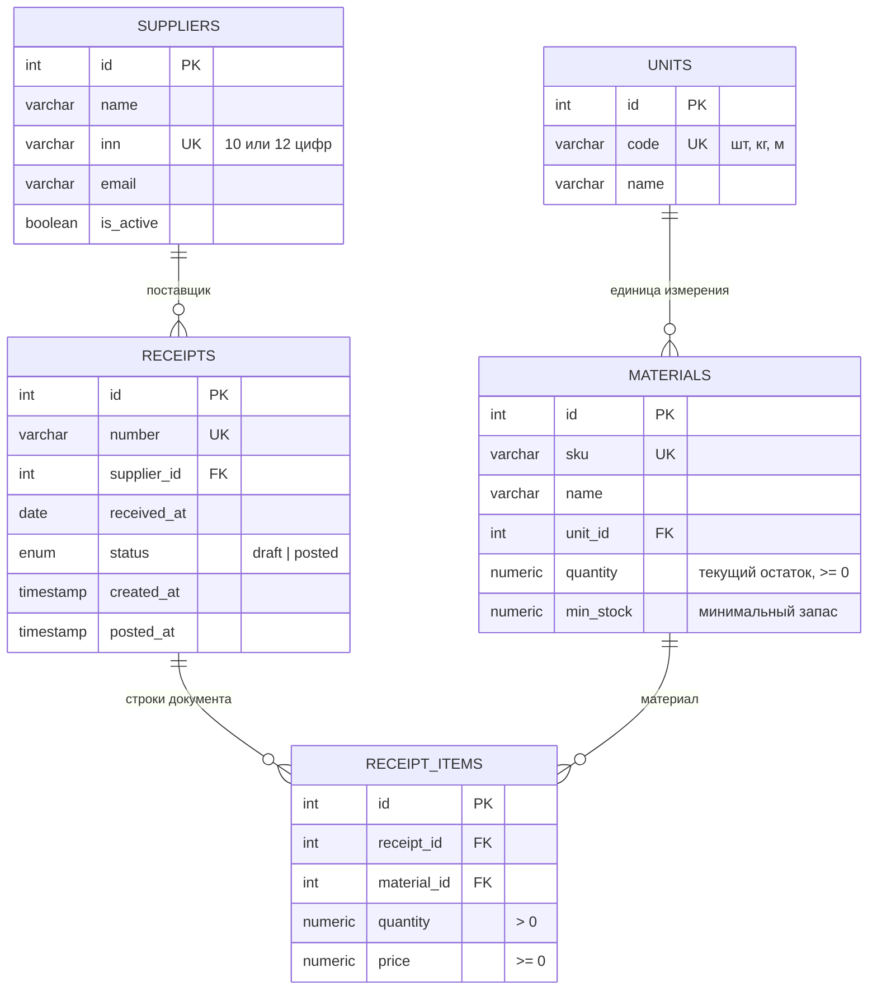

# Схема базы данных

Версия схемы: миграция `0001_initial_schema`.

## ER-диаграмма



## Таблицы

### `units` — единицы измерения

| Поле | Тип | Ограничения |
|---|---|---|
| `id` | integer | PK |
| `code` | varchar(16) | NOT NULL, UNIQUE |
| `name` | varchar(64) | NOT NULL |

### `suppliers` — поставщики

| Поле | Тип | Ограничения |
|---|---|---|
| `id` | integer | PK |
| `name` | varchar(255) | NOT NULL, индекс `ix_suppliers_name` |
| `inn` | varchar(12) | NOT NULL, UNIQUE |
| `email` | varchar(255) | NULL |
| `is_active` | boolean | NOT NULL, default `true` |

### `materials` — материалы

| Поле | Тип | Ограничения |
|---|---|---|
| `id` | integer | PK |
| `sku` | varchar(32) | NOT NULL, UNIQUE |
| `name` | varchar(255) | NOT NULL, индекс `ix_materials_name` |
| `unit_id` | integer | NOT NULL, FK → `units.id` |
| `quantity` | numeric(14,3) | NOT NULL, default 0, CHECK `quantity >= 0` |
| `min_stock` | numeric(14,3) | NOT NULL, default 0, CHECK `min_stock >= 0` |

### `receipts` — документы поступления

| Поле | Тип | Ограничения |
|---|---|---|
| `id` | integer | PK |
| `number` | varchar(32) | NOT NULL, UNIQUE |
| `supplier_id` | integer | NOT NULL, FK → `suppliers.id` |
| `received_at` | date | NOT NULL, индекс `ix_receipts_received_at` |
| `status` | enum `receipt_status` | NOT NULL, default `draft`, значения `draft`/`posted` |
| `created_at` | timestamptz | NOT NULL, default `now()` |
| `posted_at` | timestamptz | NULL, заполняется при проведении |

### `receipt_items` — строки документа

| Поле | Тип | Ограничения |
|---|---|---|
| `id` | integer | PK |
| `receipt_id` | integer | NOT NULL, FK → `receipts.id` ON DELETE CASCADE |
| `material_id` | integer | NOT NULL, FK → `materials.id`, индекс `ix_receipt_items_material_id` |
| `quantity` | numeric(14,3) | NOT NULL, CHECK `quantity > 0` |
| `price` | numeric(14,2) | NOT NULL, default 0, CHECK `price >= 0` |
| — | — | UNIQUE (`receipt_id`, `material_id`) |

## Жизненный цикл документа

```
        POST /receipts                POST /receipts/{id}/post
  ( — ) ───────────────► draft ─────────────────────────────► posted
                          │                                     │
             редактирование строк                  остатки материалов увеличены,
             удаление документа                    документ только для чтения
```

## Как изменять схему

1. Изменить модели в `app/models.py`.
2. Сгенерировать миграцию: `make makemigration M="описание"`.
3. Проверить полученный файл в `migrations/versions/` глазами (автогенерация
   не всегда корректна) и применить: `make migrate`.
4. Миграция и изменение моделей попадают в один merge request.

Ручные изменения схемы в работающей базе запрещены регламентом.
